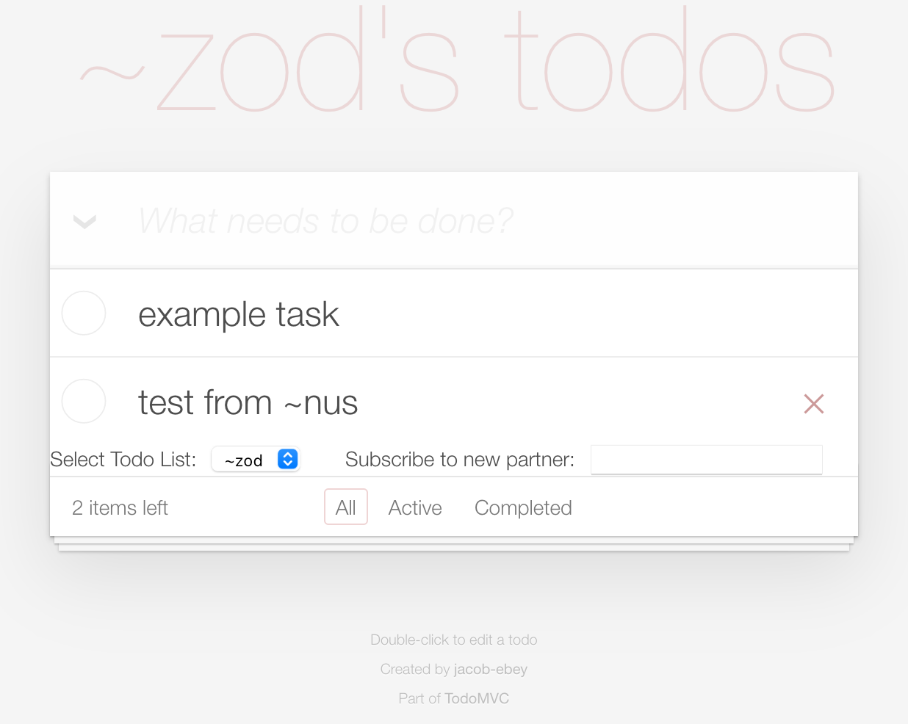

# Things Tudu and People TuSee
In this lesson, we're going to add networking to our app. You'll be able to subscribe to your friends or coworkers task lists and even, if they permit you, edit those lists (with the same level of control you have over your own lists). As a proprietor of a task list, you'll also be able to select, of those people who subscribe to your task list, who can edit and who is precluded from editing but may still look. You can even kick them from their subscription, if you're really annoyed.

This lesson includes a lot of changes but few of them are structural and most of them are just iterations on themes of prior lessons - we hope you find it fairly easy to follow.

Let's get after it then.

## Learning Checklist
* How to use wires and paths to send and receive data.
* How to add new mark files to your program for various purposes.

## Goals
* Upgrade our Earth app to handle multiple todo lists, including selecting between various lists and subscribing to additional lists.
* Add new pokes to our agent that allow for specification of the ship to which those pokes should apply.
    * This is how we'll handle pokes to remote ships from our Earth app.
    * We'll also see how you can use the same pokes you've already written to poke remote ships through the dojo.
* Add new pokes to handle receipt of new tasks data from ships you subscribe to when they make changes.

## Prerequisites
* Our Earth web app as modified in [Lesson 5 - Establishing Uplink](./lesson5-establishing-uplink.md).
    * A copy of our current Earth web app can be foudn in [src-lesson6](./src-lesson6/todomvc-start).
* A new Fake Ship (probably ~zod) with whom we can share task!
* **NOTE:** We've included a copy of all the files you need for this lesson _in their completed form_ in the folder [src-lesson6](./src-lesson6), but you should try doing this on your own instead of just copying our files in. No cheating!

## The Lesson (Part I)
We're going to start by updating our available pokes to accommodate actions required to share our todo lists, updating our state for shared todo lists and adding to the state a tuple of sets of editors; requested-editors, approved-editors and denied-editors.

Begin by launching your Fake Ship and a new Fake Ship (of your choice, we'll assume ~zod) with the Lesson 5 version of tudumvc installed and started. These two ships should be running on the same machine so they can discover eachother (fake ships are not networked _outside_ a given machine, but on the same machine they are inter-discoverable!)

You'll also want to have two terminals running to copy files from a central editing folder to _both_ of your fake ships simultaneously, to allow you to update both of them quickly.

### Updating the Types
First, we're going to update the sur file to have two new types - `shared-tasks` and `editors`:

#### Adding Types
The changes we're going to make to the type system are fairly straightforward:
<table>
<tr>
<td>
:: initial sur file version
</td>
<td>
:: new sur file version
</td>
</tr>
<tr>
<td>

```
+$  tasks  (map id=@ud [label=@tU done=?])
```
</td>
<td>

```
+$  tasks  (map id=@ud [label=@tU done=?])
+$  shared-tasks  (map owner=ship task-list=tasks)
+$  editors  [requested=(set ship) approved=(set ship) denied=(set ship)]
```
</td>
</tr>
</table>

As you can see, `shared-tasks` is simply a map of ships to our prior type (`tasks`).

Editors is slightly more complex, but it works exactly like `+cors-registry` works. We're making a tuple of `requested` `approved` and `denied` editors (the names are descriptive of their capacities - only `approved` editors can edit your task lists), each of which are `(set ship)`s. A [set](https://urbit.org/docs/hoon/reference/stdlib/2o/#set) is just a mold that creates a list-like structure that _only_ allows for unique items to be added. By using `(set ship)` instead of `(list ship)` or some other structure, we can: (1) more easily work on our `(set ship)`s using [set logic](https://urbit.org/docs/hoon/reference/stdlib/2h/) and (2) ensure that nobody gets listed twice in any one category. We'll also, later, build logic to make sure that any action taken on an editor removes them from their current category and places them in another category to make sure if you `%kick` someone from their subscription, they can't just re-subscribe and start editing your tasks.

Next, let's add some pokes to our action type in the same sur file to accommodate subscription actions:

#### Adding to Our action Type
Thinking through what we'll need here, we should prepare for the following actions:
* Subscribing to a ship's todo list.
    * Will need to specify a ship to which we will subscribe.
* Unsubscribing to a ship's todo list.
    * Will need to specify a ship to which we will subscribe.
* `%kick`ing a subscriber (or, forcefully removing someone who subscribes to you).
    * Will need to specify a ship to which we will subscribe.
    * Will also need to specify a path to kick them from - we'll talk about paths more later, but these are basically the data feed on which they're receiving your todo list. Theoretically, since we only have one data feed, [we could simply remove them from all possible paths](https://github.com/timlucmiptev/gall-guide/blob/master/poke.md#example-4-kicking-a-subscriber-from-the-host), but we'll still allow our poke to specify one or more paths, as a best practice.
* Allowing or denying a request from a subscriber to edit your todo list.
    * Will need to specify a `(list ship)`s that you want to edit.
    * Will need to specify a status for those ships (`%approve` or `%deny`)

<table>
<tr>
<td>
:: initial sur file version
</td>
<td>
:: new sur file version
</td>
</tr>
<tr>
<td>

```
+$  action
  $%
  [%add-task task=@tU]
  [%remove-task id=@ud]
  [%mark-complete id=@ud]
  [%edit-task id=@ud label=@tU]
  ==
```
</td>
<td>

```
+$  action
  $%
    [%add-task label=@tU]
    [%remove-task id=@ud]
    [%mark-complete id=@ud]
    [%edit-task id=@ud label=@tU]
    :: New action types for handling subscriptions on urbit side
    ::
    [%sub partner=ship]
    [%unsub partner=ship]
    [%force-remove paths=(list path) partner=ship]
    [%edit partners=(list ship) status=?(%approve %deny)]
  ==
```
</td>
</tr>
</table>

These should all make relative sense at this point. If, for instance, you want to subscribe to a partner, you could just key into dojo `:tudumvc &tudumvc-action [%sub ~zod]`. Similarly, you might `:tudumvc &tudumvc-action [%unsub ~zod]` to cancel that subscription later. We'll later write handlers in the main agent file to handle all this, so don't try it just yet. Nonetheless, its use should be fairly clear.

Having subscribed to someone, we are going to need some way of: (1) receiving their full list of tasks when we first subscribe and (2) receiving incremental updates as their todo list changes over time. It would be fairly inconvenient and expensive to receive the whole list each time, so we'll take each one of those updates almost exactly like we take updates to our own list:

#### Creating an updates Type
We're going to add a type called `updates` to our sur file. It's going to fairly closely mirror our original `action` type with the addition of one tagged union called `%full-send` which will send _all_ tasks to a subscriber when they first subscribe. The primary difference here is all of our incremental updates will come with an `id=@ud` identifier, just to make sure that we are updating our partner's todo list exactly as they are (to avoid `id` dis-union between proprietor and subscribers on individual todos):

<table>
<tr>
<td>
:: adding update type to our sur file (wherever)
</td>
</tr>
<td>

```
:: Here we're creating a structure arm called updates and we're re-creating the
:: task actions that might come in as updates from the ships to which we subscribe
::
+$  updates
  $%
    [%task-add id=@ud label=@tU]
    [%task-remove id=@ud]
    [%task-complete id=@ud done=?]
    [%task-edit id=@ud label=@tU]
    [%full-send =tasks]
  ==
```
</td>
</tr>
</table>

You might note, at this point, that we're not sending the source of the update (the ship name). This is because %gall actually handles that for us. Each incoming poke to our ship will be identified by a `src.bowl` which will be a ship - we can use that to easily pinpoint who's list is being updated by what updates.

Only the owner of a given list will ever send us these updates - this further ensures parity amongst all subscribers/editors/the original host in terms of the status of the tasks and their individual `id`s.

**NOTE:** These poke structures could probably be added to `action` just as easily as separated out into their own type, but we're going to use separate types for clarity. When we get to the Earth web updates, we're going to do the same thing, again, for clarity.

Let's quickly create a new mark file to handle the `updates` type we've just created and then we'll be ready to work on the main app:

#### Adding /mar/tudumvc/update.hoon
Our mar file for our `updates` type is very basic - it effectively just expects incoming data to be a noun and does no real work to convert it from other potential input types - this is ok and expected, as `update` pokes will only _ever_ be generated on the Urbit side of things, between ships with active subscriptions.

This lesson won't go into details about the various arms available in a standard mark file, outside of the `+grab` arm which, as we've seen in the last lesson, is used to convert from a non-given mark type to the given mark type, as when we converted from a JSON data mark to an `action` data mark type to allow our Earth web app to communicate with our agent in the last lesson.

Our mar file for `updates` only needs to accept incominging like-mark data from other ships, so our `+grab` arm will simply expect a noun and will coerce it into the `updates:tudumvc` type that we just created.

<table>
<tr>
<td>
:: create a file called update.hoon in your /mar/tudumvc folder
</td>
</tr>
<td>

```
::
::  tudumvc-update mar file
::
/-  tudumvc
=,  dejs:format
|_  upd=updates:tudumvc
++  grad  %noun
++  grow
  |%
  ++  noun  upd
  --
++  grab
  |%
  ++  noun  updates:tudumvc
  --
--
```
</td>
</tr>
</table>

Again, all this is really doing (of import) is the `+grab` arm is saying "if I receive a piece of data as a `noun`, coerce it into an `updates:tudumvc` noun, generally by reading the head of the tagged union vase received.

With that, we have the busy work out of the way and we're ready to work on the primary app, itself:

### Updating /app/tudumvc.hoon
We're going to start by updating our state generally. Here, we're simply setting up the changes to the state - we're still going to need to update `+on-init`, `+on-load`, `+on-poke`, and `+on-watch`, as well as adding new features to `+on-agent` and our helper core:

#### The State
Let's update our state to include the new types that we've created (`shared-tasks` and `editors`):

<table>
<tr>
<td>
:: initial version (lines 3-18)
</td>
<td>
:: new version (lines 3-16)
</td>
</tr>
<tr>
<td>

```
|%
+$  versioned-state
    $%  state-one
        state-zero
    ==
+$  state-zero
    $:  [%0 task=@tU]
    ==
+$  state-one
    $:  [%1 tasks=tasks:tudumvc]
    ==
+$  card  card:agent:gall
--
%-  agent:dbug
=|  state-one
=*  state  -
```
</td>
<td>

```
|%
+$  versioned-state
    $%  state-two
        state-one
        state-zero
    ==
+$  state-zero  [%0 task=@tU]
+$  state-one   [%1 tasks=tasks:tudumvc]
+$  state-two   [%2 shared=shared-tasks:tudumvc editors=editors:tudumvc]
+$  card  card:agent:gall
--
%-  agent:dbug
=|  state-two
=*  state  -
```
</td>
</tr>
</table>

We've only really changed three things here:
1. We've added state-two to the versioned state definition
2. We've changed the bunted state of the door to state-two (from state-one)
3. We've made our state definitions a little more terse than they were previously - but these operate exactly the same:

<table>
<tr>
<td>
:: this
</td>
<td>
:: is equal to this
</td>
</tr>
<tr>
<td>

```
+$  state-zero
    $:  [%0 task=@tU]
    ==
```
</td>
<td>

```
+$  state-zero  [%0 task=@tU]
```
</td>
</tr>
</table>

This more terse definition really just allows us to line things up nicely and present the data with less white space - it doesn't impact the meaning of the lines at all.

Let's work on our arms next:

#### ++  on-init
We only really need to change one line in our on-init section - the one that populates the bunted `state-two` sample of the door:

<table>
<tr>
<td>
:: initial version (lines 26-32)
</td>
<td>
:: new version (lines 24-30)
</td>
</tr>
<tr>
<td>

```
  ^-  (quip card _this)
  ~&  >  '%tudumvc app is online'
  =/  todo-react  [%file-server-action !>([%serve-dir /'~tudumvc' /app/tudumvc %.n %.n])]
  =.  state  [%1 `tasks:tudumvc`(~(put by tasks) 1 ['example task' %.n])]
  :_  this
  :~  [%pass /srv %agent [our.bowl %file-server] %poke todo-react]
  ==
```
</td>
<td>

```
  ^-  (quip card _this)
  ~&  >  '%tudumvc app is online'
  =/  todo-react  [%file-server-action !>([%serve-dir /'~tudumvc' /app/tudumvc %.n %.n])]
  =.  state  [%2 `shared-tasks:tudumvc`(~(put by shared) our.bowl (my :~([1 ['example task' %.n]]))) [~ ~ ~]]
  :_  this
  :~  [%pass /srv %agent [our.bowl %file-server] %poke todo-react]
  ==
```
</td>
</tr>
</table>

Remember that `+on-init` is only run once, when the application is first started (as in not _upgraded_, but installed anew). Our changed line simply adds to `shared-tasks` (a `(map ship tasks:tudumvc)`) a key of `our.bowl` (our ship name) and a value of that same initial task map we had in our Lesson 5 version. Basically we're just nesting our prior map construction (`tasks`) into a map of ships-to-maps where each ship has its own version. We'll use this later to store the maps of tasks coming from those ships to which we subscribe.

We also have added a new element to our state; a tuple of `(set ship)`s that we'll use to store requested-, approved-, and denied-editors. We're starting this off as empty sets (`[~ ~ ~]`).

With `+on-init` handled, let's make sure prior users of our app can upgrade to the latest version by updating `+on-load`:

#### ++  on-load
We need to create an upgrade path for all prior versions of our utility to the new state that we've just created above. We'll have to take into consideration that our users could be on version %0, %1 or have just started with the new version.  Just like we did in prior lessons for upgrading state, we'll take the incoming state as a vase in this arm, switch on the head of the tagged union of the state, and then update our state to a complementary version of the prior state's data, stored in the new state's data structure.

<table>
<tr>
<td>
:: initial version (lines 37-46)
</td>
<td>
:: new version (lines 35-46)
</td>
</tr>
<tr>
<td>

```
  |=  incoming-state=vase
  ^-  (quip card _this)
  ~&  >  '%tudumvc has recompiled'
  =/  state-ver  !<(versioned-state incoming-state)
  ?-  -.state-ver
    %1
  `this(state state-ver)
    %0
  `this(state [%1 `tasks:tudumvc`(~(put by tasks) 1 [task.state-ver %.n])])
  ==
```
</td>
<td>

```
  |=  incoming-state=vase
  ^-  (quip card _this)
  ~&  >  '%tudumvc has recompiled'
  =/  state-ver  !<(versioned-state incoming-state)
  ?-  -.state-ver
    %2
  `this(state state-ver)
    %1
  `this(state [%2 `shared-tasks:tudumvc`(~(put by shared) our.bowl tasks.state-ver) [~ ~ ~]])
    %0
  `this(state [%2 `shared-tasks:tudumvc`(~(put by shared) our.bowl (my :~([1 [task.state-ver %.n]]))) [~ ~ ~]])
  ==
```
</td>
</tr>
</table>

In the case where our state's head-tag is %2, we simply keep the existing state.

If we are on version %1, we're going to take our existing task list (which was individual; only for us) and add it to `shared` in the state (which is a `(map ship tasks)`) with our ship name (`our.bowl`) as the key and the existing task list as the value. We also need to bunt (provide an empty tuple of sets) the `editors` data structure, which we do with `[~ ~ ~]`.

If we are on version %0, we're doing mostly the same thing as %1, except we're first making our single-item task into a `(map id [label done])` using `(my :~([1 [task.state-ver %n]]))`, which is mostly the same as what we did in our last upgrade path.

#### ++  on-poke
We need to make a few of changes to `+on-poke` to accommodate the changes made above:
* Our `action:tudumvc` poke additions:
  * `[%sub partner=ship]`
  * `[%unsub partner=ship]`
  * `[%force-remove paths=(list path) partner=ship]`
  * `[edit partners=(list ship) status=?(%approve %deny)]`

Also, as this section is getting a little long while still being fairly high up in our program, we're going to offboard the working elements to our `hc` helper core. This just helps with legibility and doesn't majorly impact the functionality. We'll just make an arm in the helper core to handle each poke action and then call it using the `(arm data data1 data2)` form of [`%-`](https://urbit.org/docs/hoon/reference/rune/cen/#cenhep).

Let's look at the changes to the `+on-poke` arm first:

<table>
<tr>
<td>
:: initial version (lines 48-101)
</td>
<td>
:: new version (lines 48-85)
</td>
</tr>
<tr>
<td>

```
  |=  [=mark =vase]
  ^-  (quip card _this)
  |^
  =^  cards  state
  ?+  mark  (on-poke:def mark vase)
      %tudumvc-action  (poke-actions !<(action:tudumvc vase))
  ==
  [cards this]
  ::
  ++  poke-actions
    |=  =action:tudumvc
    ^-  (quip card _state)
    ?-  -.action
      %add-task
    =/  new-id=@ud
    ?~  tasks
      1
    +(-:(sort `(list @ud)`~(tap in ~(key by `(map id=@ud [task=@tU complete=?])`tasks)) gth))
    ~&  >  "Added task {<task.action>} at {<new-id>}"
    =.  state  state(tasks (~(put by tasks) new-id [+.action %.n]))
    :_  state
    ~[[%give %fact ~[/mytasks] [%json !>((json (tasks-json:hc tasks)))]]]
    ::
      %remove-task
    ?:  =(id.action 0)
      =.  state  state(tasks ~)
      :_  state
      ~[[%give %fact ~[/mytasks] [%json !>((json (tasks-json:hc tasks)))]]]
    ?.  (~(has by tasks) id.action)
      ~&  >>>  "No such task at ID {<id.action>}"
      `state
    =.  state  state(tasks (~(del by tasks) id.action))
    :_  state
    ~[[%give %fact ~[/mytasks] [%json !>((json (tasks-json:hc tasks)))]]]
    ::
      %mark-complete
    ?.  (~(has by tasks) id.action)
      ~&  >>>  "No such task at ID {<id.action>}"
      `state
    =/  task-text=@tU  label.+<:(~(get by tasks) id.action)
    =/  done-state=?  ?!  done.+>:(~(get by tasks) id.action)
    ~&  >  "Task {<task-text>} marked {<done-state>}"
    =.  state  state(tasks (~(put by tasks) id.action [task-text done-state]))
    :_  state
    ~[[%give %fact ~[/mytasks] [%json !>((json (tasks-json:hc tasks)))]]]
    ::
      %edit-task
    ~&  >  "Receiving facts {<id.action>} and {<label.action>}"
    =/  done-state=?  done.+>:(~(get by tasks) id.action)
    =.  state  state(tasks (~(put by tasks) id.action [label.action done-state]))
    :_  state
    ~[[%give %fact ~[/mytasks] [%json !>((json (tasks-json:hc tasks)))]]]
    ==
  --
```
</td>
<td>

```
  |=  [=mark =vase]
  ^-  (quip card _this)
  |^
  =^  cards  state
  ?+  mark  (on-poke:def mark vase)
      %tudumvc-action    (poke-actions !<(action:tudumvc vase))
  ==
  [cards this]
  ::
  ++  poke-actions
    |=  =action:tudumvc
    ^-  (quip card _state)
    =^  cards  state
    ?-  -.action
        %add-task
      ?>  |((team:title our.bowl src.bowl) (~(has in approved.editors) src.bowl))
      (add-task:hc our.bowl label.action)
        %remove-task
      ?>  |((team:title our.bowl src.bowl) (~(has in approved.editors) src.bowl))
      (remove-task:hc our.bowl id.action)
        %mark-complete
      ?>  |((team:title our.bowl src.bowl) (~(has in approved.editors) src.bowl))
      (mark-complete:hc our.bowl id.action)
        %edit-task
      ?>  |((team:title our.bowl src.bowl) (~(has in approved.editors) src.bowl))
      (edit-task:hc our.bowl id.action label.action)
        %sub
      (sub:hc partner.action)
        %unsub
      (unsub:hc partner.action)
        %force-remove
      ?>  (team:title our.bowl src.bowl)
      (force-remove:hc ~ partner.action)
        %edit
      ?>  (team:title our.bowl src.bowl)
      (edit:hc partners.action status.action)
    ==
    [cards state]
  --
```
</td>
</tr>
</table>

Making this section terse by offboarding to the helper core the changes made to state on each poke helps with legibility of the code.

Functionally, the primary change here is with the addition of the _assertions_ ([`?>`](https://urbit.org/docs/hoon/reference/rune/wut/#wutgar)) before most of our pokes. The assertion has a few parts that we should break down:
* [`?|`](https://urbit.org/docs/hoon/reference/rune/wut/#wutbar) (shorthand `|(condition condition1)`) allows us to check if any conditions provided to it are true and return true, if so. An OR statement, in other parlance.
* [`(team:title team-ship test-ship)`](https://github.com/urbit/urbit/blob/624e5c26929de6c666fa1585e2517f766bb8788b/pkg/arvo/sys/zuse.hoon#L4829) takes a "team" ship and a "test" ship (my terms, not documented in the code). It then checks to see if the "test" ship is in the "team" ship's "team". Basically, this just means "is this 'test' ship either the 'team' ship or one of it's subordinates (moon)?"
* `(~(has in approved.editors) src.bowl)` tests whether the source of the poke (src.bowl will always be the ship that sent the poke) is in the approved list of editors. If they are, this will return `%.y`, and if they are not `%.n`.

Our command `?> |((team:title our.bowl src.bowl) (~(has in approved.editors) src.bowl)` checks to make sure any pokes coming in for task actions (`%add` `%remove-task` `%mark-complete` `%edit-task`)come from either our ship (or one of our subordinate moons), or an approved editor from our `editors` state data structure.
**NOTE:** The command to enable editing or `%kick` (`%force-remove`) someone is reserved only for us or one of our subordinates
**NOTE:** `%sub` and `%unsub` are wide open to any user utilizing them, as we want to allow anyone to subscribe or unsubscribe to our task list (at least for now, imagine how you might modify the app to make subscriptions pendant on permissions as well).

Next, we should look at the arms from the helper core that will handle the relevant pokes. Those are as follows:

<table>
<tr>
<td>
:: add these arms to your helper core (starting on line 122 in the prior lesson's code)
</td>
</tr>
<td>

```
++  add-task
  |=  [=ship label=@tu]
  ?.  (team:title our.bol ship)
    :_  state
    ~[[%pass /send-poke %agent [ship %tudumvc] %poke %tudumvc-action !>([%add-task label])]]
  =/  task-map=tasks:tudumvc  (~(got by shared) our.bol)
  =/  new-id=@ud
  ?~  task-map
    1
  +(-:`(list @ud)`(sort ~(tap in `(set id=@ud)`~(key by `tasks:tudumvc`task-map)) gth))
  ~&  >  "Added task {<label>} at id {<new-id>}"
  =.  state  state(shared (~(put by shared) our.bol (~(put by task-map) new-id [label %.n])))
  :_  state
  :~  [%give %fact ~[/sub-tasks] [%tudumvc-update !>((updates:tudumvc %task-add new-id label))]]
      [%give %fact ~[/mytasks] [%json !>((json (tasks-json shared)))]]
  ==
++  remove-task
  |=  [=ship id=@ud]
  ?.  (team:title our.bol ship)
    :_  state
    ~[[%pass /send-poke %agent [ship %tudumvc] %poke %tudumvc-action !>([%remove-task id])]]
  ?:  =(id 0)
    =.  state  state(shared (~(put by shared) our.bol ~))
    ~&  >  "I'm here"
    :_  state
    :~  [%give %fact ~[/sub-tasks] [%tudumvc-update !>((updates:tudumvc %full-send ~))]]
        [%give %fact ~[/mytasks] [%json !>((json (tasks-json shared)))]]
    ==
  =/  task-map=tasks:tudumvc  (~(got by shared) our.bol)
  ?.  (~(has by task-map) id)
    ~&  >>>  "No task at id {<id>}"
    `state
  ~&  >  "Removing task at id {<id>} from your tasks"
  =.  state  state(shared (~(put by shared) our.bol (~(del by task-map) id)))
  :_  state
  :~  [%give %fact ~[/sub-tasks] [%tudumvc-update !>((updates:tudumvc %task-remove id))]]
      [%give %fact ~[/mytasks] [%json !>((json (tasks-json shared)))]]
  ==
++  mark-complete
  |=  [=ship id=@ud]
  ?.  (team:title our.bol ship)
    :_  state
    ~[[%pass /send-poke %agent [ship %tudumvc] %poke %tudumvc-action !>([%mark-complete id])]]
  =/  task-map=tasks:tudumvc  (~(got by shared) our.bol)
  ?.  (~(has by task-map) id)
    ~&  >>>  "No task at id {<id>}"
    `state
  =/  task-text=@tU  label.+<:(~(get by task-map) id)
  =/  done-state=?  ?!  done.+>:(~(get by task-map) id)
  =.  state  state(shared (~(put by shared) our.bol (~(put by task-map) id [task-text done-state])))
  ~&  >  "Task {<task-text>} marked {<done-state>}"
  :_  state
  :~  [%give %fact ~[/sub-tasks] [%tudumvc-update !>((updates:tudumvc %task-complete id done-state))]]
      [%give %fact ~[/mytasks] [%json !>((json (tasks-json shared)))]]
  ==
++  edit-task
  |=  [=ship id=@ud label=@tU]
  ?.  (team:title our.bol ship)
    :_  state
    ~[[%pass /send-poke %agent [ship %tudumvc] %poke %tudumvc-action !>([%edit-task id label])]]
  =/  task-map=tasks:tudumvc  (~(got by shared) our.bol)
  ?.  (~(has by task-map) id)
    ~&  >>>  "No such task at id {<id>}"
    `state
  ~&  >  "Task id {<id>} text changed to {<label>}"
  =/  done-state=?  done.+>:(~(get by task-map) id)
  =.  state  state(shared (~(put by shared) our.bol (~(put by task-map) id [label done-state])))
  :_  state
  :~  [%give %fact ~[/sub-tasks] [%tudumvc-update !>((updates:tudumvc %task-edit id label))]]
      [%give %fact ~[/mytasks] [%json !>((json (tasks-json shared)))]]
  ==
++  sub
  |=  partner=ship
  ~&  >  "Subscribing to {<partner>}'s tasks"
  :_  state
  ~[[%pass /sub-tasks/(scot %p our.bol) %agent [partner %tudumvc] %watch /sub-tasks]]
++  unsub
  |=  partner=ship
  ~&  >  "Unsubscribing from {<partner>}'s tasks"
  =.  shared  (~(del by shared) partner)
  :_  state
  :~  [%pass /sub-tasks/(scot %p our.bol) %agent [partner %tudumvc] %leave ~]
      [%give %fact ~[/mytasks] [%json !>((json (tasks-json shared)))]]
  ==
++  force-remove
  |=  [paths=(list path) partner=ship]
  =.  editors  [(~(dif in requested.editors) (sy ~[partner])) (~(dif in approved.editors) (sy ~[partner])) (~(dif in denied.editors) (sy ~[partner]))]
  :_  state
  ~[[%give %kick paths `partner]]
++  edit
  |=  [partners=(list ship) status=?(%approve %deny)]
  ?-  status
      %approve
    =.  editors  [(~(dif in requested.editors) (sy partners)) (~(gas in approved.editors) partners) (~(dif in denied.editors) (sy partners))]
    `state
      %deny
    =.  editors  [(~(dif in requested.editors) (sy partners)) (~(dif in approved.editors) (sy partners)) (~(gas in denied.editors) partners)]
    `state
  ==
```
</td>
</tr>
</table>

That may seem like a lot of code, but most of it you're already familiar with. If you compare the `+add-task` arm to our prior code, as below:

<table>
<tr>
<td>
:: initial version (lines 48-101)
</td>
<td>
:: new version (lines 48-85)
</td>
</tr>
<tr>
<td>

```
      %add-task
    =/  new-id=@ud
    ?~  tasks
      1
    +(-:(sort `(list @ud)`~(tap in ~(key by `(map id=@ud [task=@tU complete=?])`tasks)) gth))
    ~&  >  "Added task {<task.action>} at {<new-id>}"
    =.  state  state(tasks (~(put by tasks) new-id [+.action %.n]))
    :_  state
    ~[[%give %fact ~[/mytasks] [%json !>((json (tasks-json:hc tasks)))]]]
    ::
```
</td>
<td>

```
++  add-task
  |=  [=ship label=@tu]
  ?.  (team:title our.bol ship)
    :_  state
    ~[[%pass /send-poke %agent [ship %tudumvc] %poke %tudumvc-action !>([%add-task label])]]
  =/  task-map=tasks:tudumvc  (~(got by shared) our.bol)
  =/  new-id=@ud
  ?~  task-map
    1
  +(-:`(list @ud)`(sort ~(tap in `(set id=@ud)`~(key by `tasks:tudumvc`task-map)) gth))
  ~&  >  "Added task {<label>} at id {<new-id>}"
  =.  state  state(shared (~(put by shared) our.bol (~(put by task-map) new-id [label %.n])))
  :_  state
  :~  [%give %fact ~[/sub-tasks] [%tudumvc-update !>((updates:tudumvc %task-add new-id label))]]
      [%give %fact ~[/mytasks] [%json !>((json (tasks-json shared)))]]
  ==
```
</td>
</tr>
</table>

You should see that this isn't really that different. There are only really two major changes.
1. We're adding a test at the top to determine if the poke came from our ship - but we're only passing `our.bowl` ever in `+on-poke`.
  * Later on, we'll add some Earth web functionality to allow us to use this test to `%give` a poke to some other ship's task list from the frontend, so that we can interact with their task list - don't worry about this just yet.
2. We're `%give`ing a `%fact` on a new path, `/sub-tasks` using our new mark (`updates`).
  * `%facts` passed on paths work exactly like what we were doing preivously to send our tasks list to our Earth web app, except we don't have to convert them to `%json`. 
  * Instead of `%json`, we're sending a [cage](https://github.com/urbit/urbit/blob/624e5c26929de6c666fa1585e2517f766bb8788b/pkg/arvo/sys/arvo.hoon#L45) (or a pair of a mark and a vase) `%tudumvc-update` (which will use the update mark we just made) `!>((updates:tudumvc %task-add new-id label))` (which is a vase of `updates` tagged union type, specifically `%task-add`).
  * We'll use this functionality to announce to our subscribers when we change the state of our task list. Basically, we'll send incremental updates as we add, remove, edit or mark complete our various tasks.

Incremental updates are great and save some computational power over sending all of our tasks as a package every time we update our state. As previously mentioned, we'll also send a task id for each incremental update just to make sure all ships stay in perfect pairity. But, we need to give our subscribers our full task list at least once, when they first subscribe. We do that in the arm that handles `%sub` pokes:

```
++  sub
  |=  partner=ship
  ~&  >  "Subscribing to {<partner>}'s tasks"
  :_  state
  ~[[%pass /sub-tasks/(scot %p our.bol) %agent [partner %tudumvc] %watch /sub-tasks]]
```

This part is a little confusing - we poke our _own_ ship with `:tudumvc &tudumvc-action [%sub ~sampel-palnet]` to subscribe to (e.g.) `~sampel-palnet`'s task list. The arm handling that poke then tells our partner-ship that we want to subscribe using a card with the format `[%pass wire %agent [partner-ship app] %watch path]`. This card will send to our partner-ship and tell them that we're going to start watching some path for data (note that `/sub-tasks` is the path we previously mentioned we'd send incremental updates on).

**NOTE:** The [`wire`](https://github.com/urbit/urbit/blob/624e5c26929de6c666fa1585e2517f766bb8788b/pkg/arvo/sys/arvo.hoon#L135) is really just another path, but that path must be unique to this individual subscription (at least until the subscription is terminated - some apps may terminate subscriptions or `%watch`es immediately, and so they can re-use the same wire data repeatedly). You might think of it like this - the _path_ dictates _what_ data we'll receive, the _wire_ indicates _individual subscriptions_ on that path, on which the data will be received. Further, note that the wire could be completely different from the path (e.g., instead of `/sub-tasks/(scot %p our.bol)`,  something like `/arbitrary-wire/random-number`) - again, it's just a unique identifier for recipients of data sent along the path.

In our changes to `+on-watch`, we'll see how beginning to `%watch` a ship results in getting the full task list from the state of that ship, but it starts here with generating the `%watch`.

To complete this section, however, let's look at three further actions; `%unsub`, `%force-remove` and `%edit`.

```
++  unsub
  |=  partner=ship
  ~&  >  "Unsubscribing from {<partner>}'s tasks"
  =.  shared  (~(del by shared) partner)
  :_  state
  :~  [%pass /sub-tasks/(scot %p our.bol) %agent [partner %tudumvc] %leave ~]
      [%give %fact ~[/mytasks] [%json !>((json (tasks-json shared)))]]
  ==
```

`%unsub` has three important fuctions. When we unsubscribe from one of our partners, we first delete their task list from our `shared` data structure (`(~(del by shared) partner)`). We then use the format `[%pass wire %agent [partner app] %leave ~]` to communicate to that partner that we're no longer listening on that path (and thereby we free the wire for use by someone/something else, theoretically). Lastly, we update our Earth web app w/ the change to our state (effectively removing those tasks from the Earth web app, so we don't try to interact with them).

```
++  force-remove
  |=  [paths=(list path) partner=ship]
  =.  editors  [(~(dif in requested.editors) (sy ~[partner])) (~(dif in approved.editors) (sy ~[partner])) (~(dif in denied.editors) (sy ~[partner]))]
  :_  state
  ~[[%give %kick paths `partner]]
```

`%force-remove` allows us to `%give` a `%kick` to any subscriber - this effectively just removes them from listening to us on our path and is the same as a non-optional `%unsub` poke to the subscriber-ship. The pattern for `%kick`s is `[%give %kick (list path) (unit ship)]`. A note here, better covered in [~timluc-miptev's Gall Guide](https://github.com/timlucmiptev/gall-guide/blob/master/poke.md#fact-or-kick-nuances), is that an empty (`~`) list of paths will, in this context, unsubscribe the user from _all_ paths to which they subscribe. In our context, there's only one real subscription action the user can take, so it doesn't make a lot of difference for us, but it's good to know.

In addition to `%kick`ing the partner from their subscription, `%force-remove` also removes the target from any/all allowances or denials they may have in the `editors` list. We do this using the [`(~(dif in set) set1)`](https://urbit.org/docs/hoon/reference/stdlib/2h/#dif-in) set-logic function which computes the difference between two sets (providing the diverse elements of the set). In other words, we check to see whether the partner we're kicking is in each of the subsets of the tuple in our data element called `editors` and we produce the result with that ship removed. 

```
++  edit
  |=  [partners=(list ship) status=?(%approve %deny)]
  ?-  status
      %approve
    =.  editors  [(~(dif in requested.editors) (sy partners)) (~(gas in approved.editors) partners) (~(dif in denied.editors) (sy partners))]
    `state
      %deny
    =.  editors  [(~(dif in requested.editors) (sy partners)) (~(dif in approved.editors) (sy partners)) (~(gas in denied.editors) partners)]
    `state
  ==
```

`%edit`, our last poke action to cover, moves our subscribers from the `%requested` set in our `editors` tuple to one of the other access levels - either approved on denied editors. We use the same `+dif:in` arm to manipulate our sets as we did above on `%force-remove`. In addition, we add members to a given set using the standard library function [`gas:in`](https://urbit.org/docs/hoon/reference/stdlib/2h/#gas-in).

#### ++  on-peek
We should probably update on-peek at some time, right? Maybe later.

#### ++  on-watch
`+on-watch` is new in is great, because it uses `%gall`s built-in distributed-app functionality to handle our data delivery for us. It listens for a path (as a gate that takes a path) in a `%watch` card received to our agent. From the path, it knows what data to start delivering. In our last lesson, we implemented a path on which apps can listen, `/mytasks`, and receive `%json` data. In this version, we're adding `/sub-tasks` that returns the same data (our task list) in a hoon format.

<table>
<tr>
<td>
:: initial version (lines 109-115)
</td>
<td>
:: new version (lines 114-125)
</td>
</tr>
<tr>
<td>

```
  |=  =path
  ^-  (quip card _this)
  ?+  path  (on-watch:def path)
    [%mytasks ~]
  :_  this
  ~[[%give %fact ~[path] [%json !>((json (tasks-json:hc tasks)))]]]
  ==
```
</td>

<td>

```
  |=  =path
  ^-  (quip card _this)
  =/  my-tasks=tasks:tudumvc  (~(got by shared) our.bowl)
  ?+  -.path  (on-watch:def path)
      %mytasks
    :_  this
    ~[[%give %fact ~ [%json !>((json (tasks-json:hc shared)))]]]
      %sub-tasks
    =.  requested.editors  (~(gas in requested.editors) ~[src.bowl])
    :_  this
    ~[[%give %fact ~ [%tudumvc-update !>((updates:tudumvc %full-send my-tasks))]]]
  ==
```
</td>
</tr>
</table>

The agent will send a card the first time a ship starts to `%watch` `/sub-tasks` using `[%give %fact ~ [%tudumvc-update !>((updates:tudumvc %full-send my-tasks))]]` - we'll see how that's handled in `+on-agent`, below.

The agent also, when hearing a `%watch` on `/sub-tasks`, adds the subscriber to the `requested.editors` set of our state (letting you know they've asked for access to edit your tasks).

#### ++  on-agent
In `+on-agent`, we'll handle cards coming from other ships on our various wires. That is, subscriptions we've made will be sent data, and that data (sent in the form of `%fact`s or `%kick`s, in this case) will be processed using the code we add to this arm. We will need to write code to handle:

* Our `updates:tudumvc` poke structure entirely:
  * `[%task-add id=@ud label=@tu]`
  * `[%task-remove id=@ud]`
  * `[%task-complete id=@ud done=?]`
  * `[%task-edit id=@ud label=@tU]`
  * `[%full-send =tasks]`
* Any `%kick`s we receive from ships we're subscribed to.

<table>
<tr>
<td>
:: initial version (line 118)
</td>
<td>
:: new version (lines 127-185)
</td>
</tr>
<tr>
<td>

```
on-arvo:def
```
</td>

<td>

```
  |=  [=wire =sign:agent:gall]
  ^-  (quip card _this)
  |^
  ?+  -.sign  (on-agent:def wire sign)
      %fact
    =/  update-action=updates:tudumvc  !<(updates:tudumvc q.cage.sign)
    =^  cards  this
    ?-  -.update-action
        %full-send
      ~&  >  "Receiving {<src.bowl>}'s task list"
      =.  shared  (~(put by shared) src.bowl tasks.update-action)
      :_  this
      ~[[%give %fact ~[/mytasks] [%json !>((json (tasks-json:hc shared)))]]]
        %task-add
      ~&  >  "Receiving task {<label.update-action>} from {<src.bowl>}'s list"
      (partner-add id.update-action label.update-action src.bowl)
        %task-remove
      ~&  >  "Removing task {<id.update-action>} from {<src.bowl>}'s list"
      (partner-remove id.update-action src.bowl)
        %task-complete
      ~&  >  "Marking {<src.bowl>}'s task {<id.update-action>} as done: {<done.update-action>}"
      (partner-complete id.update-action done.update-action src.bowl)
        %task-edit
      ~&  >  "Editing {<src.bowl>}'s task {<id.update-action>} to read {<label.update-action>}"
      (partner-edit id.update-action label.update-action src.bowl)
    ==
    [cards this]
      %kick
    ~&  >  "{<src.bowl>} gave %kick - removing shared list"
    =.  shared  (~(del by shared) src.bowl)
    `this
  ==
  ++  partner-add
    |=  [id=@ud task=@tU =ship]
    =/  partner-list=tasks:tudumvc  (~(got by shared) ship)
    =.  shared  (~(put by shared) ship (~(put by partner-list) id [task %.n]))
    :_  this
    ~[[%give %fact ~[/mytasks] [%json !>((json (tasks-json:hc shared)))]]]
  ++  partner-remove
    |=  [id=@ud =ship]
    =/  partner-list=tasks:tudumvc  (~(got by shared) ship)
    =.  shared  (~(put by shared) ship (~(del by partner-list) id))
    :_  this
    ~[[%give %fact ~[/mytasks] [%json !>((json (tasks-json:hc shared)))]]]
  ++  partner-complete
    |=  [id=@ud done=? =ship]
    =/  partner-list=tasks:tudumvc  (~(got by shared) ship)
    =/  task=@tU  label:(~(got by partner-list) id)
    =.  shared  (~(put by shared) ship (~(put by partner-list) id [task done]))
    :_  this
    ~[[%give %fact ~[/mytasks] [%json !>((json (tasks-json:hc shared)))]]]
  ++  partner-edit
    |=  [id=@ud task=@tU =ship]
    =/  partner-list=tasks:tudumvc  (~(got by shared) ship)
    =/  done=?  done:(~(got by partner-list) id)
    =.  shared  (~(put by shared) ship (~(put by partner-list) id [task done]))
    :_  this
    ~[[%give %fact ~[/mytasks] [%json !>((json (tasks-json:hc shared)))]]]
  --
```
</td>
</tr>
</table>

If our agent is receiving a `%fact` on the `/sub-tasks/...` wire that we created for a subscription, it should be one of the `updates:tudumvc` types. Most of these are handled in their own arm of the `+on-agent` `|^` core, but `%full-send` is handled in-line. 

`%full-send` takes in a full task list from some ship (`src.bowl`) and simply adds it to our `shared` data object in our state, by adding a key (of the ship) value (of the full task list) pair to that map.

All of the other incremental data types (`%task-add`, `%task-remove`, `%task-complete` and `%task-edit`) functional generally similar to how they do when we're poking our own ship for state changes. They even send the data up to our Earth app on `/mytasks`.

If our agent is receiving a `%kick`, it cleans up our data with [`del:by`](https://urbit.org/docs/hoon/reference/stdlib/2i/#del-by) and deletes the task list we were maintaining for that subscription.

#### ++  on-leave
We also need to update `+on-leave` to handle people unsubscribing from our agent. All we're going to do here is [`~&`](https://urbit.org/docs/hoon/reference/rune/sig/#sigpam) a message to the dojo indicating that some subscriber has left, and then remove that user from the `editors` data object entirely (so they aren't left with approved/denied edit rights, or left in the requested set).

**NOTE:** `+on-leave` takes a path. If your app had multiple subscription paths, you could use this to switch behavior on unsubscribe based on what the user is unsubscribing from.

<table>
<tr>
<td>
:: initial version (line 117)
</td>
<td>
:: new version (lines 187-191)
</td>
</tr>
<tr>
<td>

```
on-leave:def
```
</td>

<td>

```
  |=  =path
  ^-  (quip card _this)
  ~&  >>  "{<src.bowl>} has left the chat"
  =.  editors  [(~(dif in requested.editors) (sy ~[src.bowl])) (~(dif in approved.editors) (sy ~[src.bowl])) (~(dif in denied.editors) (sy ~[src.bowl]))]
  `this
```
</td>
</tr>
</table>

#### ++  tasks-json
While we haven't yet updated our Earth web app to handle the data from multiple ships, we're going to update `tasks-json` to work with our new state data in advance. In the next part of this lesson, we'll update the Earth app to accommodate this data and to allow it to send task actions to remote ships (sort of - our pattern will actually be telling _our_ agent to tell the other ships to change the task).

Our changes to this section are, again, fairly straightforward:

<table>
<tr>
<td>
:: initial version (lines 123-139)
</td>
<td>
:: new version (lines 198-223)
</td>
</tr>
<tr>
<td>

```
  |=  stat=tasks:tudumvc
  |^
  ^-  json
  =/  tasklist=(list [id=@ud label=@tU done=?])  ~(tap by stat)
  =/  objs=(list json)  (roll tasklist object-maker)
  [%a objs]
  ++  object-maker
  |=  [in=[id=@ud label=@tU done=?] out=(list json)]
  ^-  (list json)
  :-
  %-  pairs:enjs:format
    :~  ['done' [%b done.in]]
        ['id' [%s (scot %ud id.in)]]
        ['label' [%s label.in]]
    ==
  out
  --
```
</td>

<td>

```
++  tasks-json
  |=  stat=shared-tasks:tudumvc
  |^
  ^-  json
  =/  shared-tasks=(list [partner=ship tasks=tasks:tudumvc])  ~(tap by stat)
  =/  objs=(list json)  (roll shared-tasks partner-handler)
  [%a objs]
  ++  partner-handler
    |=  [in=[partner=ship tasks=tasks:tudumvc] out=(list json)]
    ^-  (list json)
    =/  partners-tasks=(list [id=@ud label=@tU done=?])  ~(tap by tasks.in)
    =/  objs=(list json)  (roll partners-tasks object-maker)
    :-
    %-  pairs:enjs:format
      :~  [`@tU`(scot %p partner.in) [%a objs]]  ==
    out
  ++  object-maker
    |=  [in=[id=@ud label=@tU done=?] out=(list json)]
    ^-  (list json)
    :-
    %-  pairs:enjs:format
      :~  ['done' [%b done.in]]
          ['id' [%s (scot %ud id.in)]]
          ['label' [%s label.in]]
      ==
    out
  --
```
</td>
</tr>
</table>

The big change here is that we're taking a `shared-tasks` input, or a `(map ship tasks)`, rather than just a `tasks` input. We're then basically repeating what we did in the last version, but for each ship, and creating an array of JSON objects structured something like this: `{'~sampel-palnet': [{'id': 1, 'label': 'the label', 'done': FALSE} {'id': 2, 'label': 'the label 2', 'done': FALSE}]}`. We'll be able to switch between the elements of this array to show all of the task lists for our own ship and any ship to which we subscribe.

### Testing General Networking
We should now have all we need to establish basic `%gall`-side networking of our agent. While the frontend wont work just yet, we can start testing the `%gall` side - try a few of the following actions between your two test ships after syncing:

* Check your state:
`:tudumvc +dbug %state` should yield something like:
```
>   [ %2
    shared
  { [ p=owner=~nus
        q
        task-list
      {[p=id=1 q=[label='example task' done=%.n]]}
    ]
  }
  editors=[requested={} approved={} denied={}]
]
```
We can see our new state here - great!

* Subscribe to a friend:
`:tudumvc &tudumvc-action [%sub ~zod]` will show, on the subscribing ship:
```
>   "Subscribing to ~zod's tasks"
> :tudumvc &tudumvc-action [%sub ~zod]
>=
>   "Receiving ~zod's task list"
```
Let's check our state again:
```
>   [ %2
    shared
  { [ p=owner=~nus
        q
        task-list
      {[p=id=1 q=[label='example task' done=%.n]]}
    ]
    [ p=owner=~zod
        q
        task-list
      {[p=id=1 q=[label='example task' done=%.n]]}
    ]
  }
  editors=[requested={} approved={} denied={}]
]
```
Nice! We've got ~zod's list of tasks, alongside ours.

And, if we then check ~zod's state with `:tudumvc +dbug %state`:
```
>   [ %2
    shared
  { [ p=owner=~zod
        q
        task-list
      {[p=id=1 q=[label='example task' done=%.n]]}
    ]
  }
  editors=[requested={~nus} approved={} denied={}]
]
```
We can see that ~zod has dutifully recorded ~nus as a potential editor.

* Approve an editor:
Running `:tudumvc &tudumvc-action [%edit ~[~nus] %approve]` on ~zod will add ~nus to the list of approved editors. You can check ~zod's state after running this to confirm:
```
>   [ %2
    shared
  { [ p=owner=~zod
        q
        task-list
      {[p=id=1 q=[label='example task' done=%.n]]}
    ]
  }
  editors=[requested={} approved={~nus} denied={}]
```

* Add a task as an approved editor:
From ~nus, run `:~zod/tudumvc &tudumvc-action [%add-task 'test from ~nus']` and you'll see, first on ~zod:
```
>=
>   "Added task ~~test.from.~~nus at id 2"
```
And then on ~nus:
```
>=
>   "Receiving task 'test from ~nus' from ~zod's list"
```
Note the order of operations:
1. We sent the poke to ~zod telling it to add a task
2. ~zod checked to determine if we were in the approved list (line 63)
3. ~zod performed the add action using the helper core
4. ~zod passed the updated data back along the `/sub-tasks` path to ~nus
5. ~nus updated its stored registry of ~zod's tasks

* Kick ~nus from subscribing, using ~zod's interface:
From ~zod, run `:tudumvc &tudumvc-action [%force-remove ~ ~nus]`. ~nus will produce:
```
>   "~zod gave %kick - removing shared list"
```
And, if you check her state thereafter:
```
>   [ %2
    shared
  { [ p=owner=~nus
        q
        task-list
      { [ p=id=1
            q
          [ label='example task'
            done=%.n
          ]
        ]
      }
    ]
  }
    editors
  [requested={} approved={} denied={}]
]
```

Fiddle around with this a little more and get comfortable with the way the ships are now interacting, and then continue on to Part II of the Lesson.

## The Lesson (Part II)
In this, the last section of this guide, we're going to implement Earth web support for the changes we made in the last section. Let's start with the hoon changes:

### Adding Support for Frontend Actions
We're going to use unique pokes from the Earth web app to handle actions for our task lists and those to which we subscribe. We're doing it this way because airlock doesn't handle 'remote' pokes the way we did from dojo in the last section (e.g. `:~zod/tudumvc &tudumvc-action [%add-task 'test task from ~nus']`). Instead, we'll poke our hosting ship from the frontend w/ data about to whom the change in task data is directed and the host ship will then send a card (a poke) to that remote ship, or apply it to its own task list, as appropriate.

#### Creating A frontend Type
Let's add a `frontend` type to our sur file. It's going to be exactly like our original `action` type, but each tagged union element will _also_ include a ship name. This will help us direct these pokes to the appropriate task-holder. Note that you'll still have to have permission to edit a remote ship's tasks for these to actually process.

<table>
<tr>
<td>
:: adding frontend type to our sur file (wherever)
</td>
</tr>
<td>

```
:: Creates a structure for front end usage that will specify the ship to poke on 
:: each action, allowing our host ship to then send cards to each recipient ship
:: 
+$  frontend
  $%
    [%add-task =ship label=@tU]
    [%remove-task =ship id=@ud]
    [%mark-complete =ship id=@ud]
    [%edit-task =ship id=@ud label=@tU]
  ==
```
</td>
</tr>
</table>

#### Adding /mar/tudumvc/frontend.hoon
We need to create a mark that will handle these new `frontend` type. This mark will need to handle incoming JSON data from our Earth web app, so we'll put some conversions to hoon types in our `+grab` arm:

<table>
<tr>
<td>
:: create a file called frontend.hoon in your /mar/tudumvc folder
</td>
</tr>
<td>

```
:: Creates a structure for front end usage that will specify the ship to poke on 
:: each action, allowing our host ship to then send cards to each recipient ship
:: 
::
::  tudumvc-frontend mar file
::
/-  tudumvc
=,  dejs:format
|_  front=frontend:tudumvc
++  grad  %noun
++  grow
  |%
  ++  noun  front
  --
++  grab
  |%
  ++  noun  frontend:tudumvc
  ++  json
    |=  jon=^json
    %-  frontend:tudumvc
    =<
    (front-end jon)
    |%
    ++  front-end
      %-  of
      :~  [%add-task (ot :~(['ship' (se %p)] ['label' so]))]
          [%remove-task (ot :~(['ship' (se %p)] ['id' ni]))]
          [%mark-complete (ot :~(['ship' (se %p)] ['id' ni]))]
          [%edit-task (ot :~(['ship' (se %p)] ['id' ni] ['label' so]))]
      ==
    --
  --
--
```
</td>
</tr>
</table>

By now, you should be able to fairly easily read the JSON parsing we're doing here. Even if you're struggling with it, you should be able to see that these produce data in noun format that is of the `frontend` type we just created.

### Updating /app/tudumvc.hoon
We now need to handle these pokes in our Urbit app. We only really need to work on `+on-poke`.

#### ++  on-poke
First, we need to change the expected marks we might see coming in to `+on-poke`:

<table>
<tr>
<td>
:: initial version (lines 52-54)
</td>
<td>
:: new version (lines 52-55)
</td>
</tr>
<tr>
<td>

```
  ?+  mark  (on-poke:def mark vase)
      %tudumvc-action    (poke-actions !<(action:tudumvc vase))
  ==
```
</td>

<td>

```
  ?+  mark  (on-poke:def mark vase)
      %tudumvc-action    (poke-actions !<(action:tudumvc vase))
      %tudumvc-frontend  (frontend-actions !<(frontend:tudumvc vase))
  ==
```
</td>
</tr>
</table>

Then, let's add an arm that will handle those `frontend` type pokes:

<table>
<tr>
<td>
:: add an arm under poke-actions called frontend-actions
</td>
</tr>
<td>

```
  ++  frontend-actions
    |=  =frontend:tudumvc
    ^-  (quip card _state)
    =^  cards  state
    ?-  -.frontend
        %add-task
      ?>  (team:title our.bowl src.bowl)
      (add-task:hc ship.frontend label.frontend)
        %remove-task
      ?>  (team:title our.bowl src.bowl)
      (remove-task:hc ship.frontend id.frontend)
        %mark-complete
      ?>  (team:title our.bowl src.bowl)
      (mark-complete:hc ship.frontend id.frontend)
        %edit-task
      ?>  (team:title our.bowl src.bowl)
      (edit-task:hc ship.frontend id.frontend label.frontend)
    ==
    [cards state]
```
</td>
</tr>
</table>

And now we can see why we added ship argument to our helper-core arms that handle changes. Before, when only using dojo, we can simply poke a remote ship and it will know to apply the changes to itself. From the Earth web, however, we're poking _our_ ship with data about the ship to which the change should apply. If we take a look at `+add-task:hc`:
```
++  add-task
  |=  [=ship label=@tu]
  ?.  (team:title our.bol ship)
    :_  state
    ~[[%pass /send-poke %agent [ship %tudumvc] %poke %tudumvc-action !>([%add-task label])]]
  =/  task-map=tasks:tudumvc  (~(got by shared) our.bol)
  =/  new-id=@ud
  ?~  task-map
    1
  +(-:`(list @ud)`(sort ~(tap in `(set id=@ud)`~(key by `tasks:tudumvc`task-map)) gth))
  ~&  >  "Added task {<label>} at id {<new-id>}"
  =.  state  state(shared (~(put by shared) our.bol (~(put by task-map) new-id [label %.n])))
  :_  state
  :~  [%give %fact ~[/sub-tasks] [%tudumvc-update !>((updates:tudumvc %task-add new-id label))]]
      [%give %fact ~[/mytasks] [%json !>((json (tasks-json shared)))]]
  ==
```

We can see that _if_ the ship being passed is not our own, rather than updating our state directly, we create a card to `%pass` a `%poke` to the destination ship using our original `action` type as one of those basic operators (e.g. `[%add task label]`).

To finish, then, we should update the Earth web app.

### Updating TodoMVC JavaScript
This isn't a React tutorial, and I'm not entirely positive my implementation is the best methodology so we're going to focus in on the changes that work with airlock, rather than going through all of the changes made to React to support the incoming data.

#### Changes to Pokes

<table>
<tr>
<td>
:: initial version of addTodo
</td>
<td>
:: new version of addTodo
</td>
</tr>
<tr>
<td>

```
  const addTodo = (task) => {
    urb.poke({app: 'tudumvc', mark: 'tudumvc-action', json: {'add-task': task}})
  };
```
</td>

<td>

```
  const addTodo = (label) => {
    urb.poke({app: 'tudumvc', mark: 'tudumvc-frontend', json: {'add-task': {'ship': subList[selected][1], 'label': label}}})
  };
```
</td>
</tr>
</table>

The big change here is that we're adding in a specified ship to the poke we're sending down, and we're changing the mark to `tudumvc-frontend`. Thankfully, we already created the JSON handling in the mark, so we're all set there. The other pokes change in exactly the same way.

The data flow will be:
1. Earth web app allows you to select a ship.
  * You can also subscribe to a new ship from the Earth web app (see addSub function).
2. Earth web app displays the selected ship's task list.
3. User makes changes to the Earth web displayed tasks for some ship.
4. Earth web pokes host ship with:
  * The ship to whom the action should be sent.
  * The action data itself.
5. Host ship's app determines how to direct that action and either applies it locally or passes it as a poke to the recipient.
6. Granting that the host ship is an approved editor for the recipient, the change is applied.

And, just like that, we've created a networked version of TodoMVC using Urbit as our data hosting platform. TodoMVC is dead, long live `%tudumvc`.



## Homework
No homework this time - maybe in our next course!

## Exercises
* Beautify the display of tuduMVC in browser by cleaning up my pitiable implementation of the drop-down menu and the input box.
    * See if you can add ship name validation to the subscription box
* Add to the data being sent to the site a list of people requesting edit access to your task list, and a method whereby you can provide them edit access or deny their request
* Add an approval list for people requesting access to your todo list so not just anyone can subscribe.
    * This will require several other changes, in addition to just having the list.

## Summary and Addenda
Well - you did it. You've just built your first app supported entirely by Urbit, with networking. 

Should you have any questions, please reach out to ~rabsef-bicrym via Urbit DM and we'll try to get back to you quickly.

We hope you had fun and learned at least a few things. Maybe you've even been inspired to build your next project on Urbit! If you do build something, please make sure to let us know!

<hr>
<table>
<tr>
<td>

[< Lesson 5 - Establishing Uplink](./lesson4-updating-our-agent.md)
</td>
</tr>
</table>